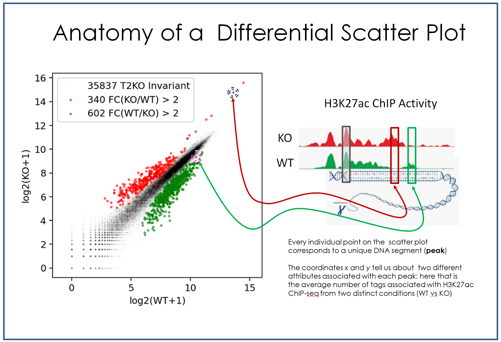

  
# PEAKDIFF

This code is part of a fundamental bioinformatics analysis pipeline designed to integrate ATAC-seq and H3K27ac ChIP-seq data, commonly used in bioinformatics to compare two biological conditions for differential analysis. It processes and visualizes ChIP-seq signal intensity around distal ATAC-seq peaks within a variable basepare window size, identifying regions of differential acetylation determined by DESeq2 (FC > 2, p-adj < 0.05). The code generates scatter plots showing the average signal for both conditions, highlighting differentially acetylated regions. These plots incorporate enhancer annotations, including KC signature enhancers, and apply color coding (red/orange for increased acetylation, blue/purple for decreased acetylation) to facilitate comparison between conditions, especially in regions of biological significance such as those overlapping with KC signature enhancers.

 
### Data Input:
- **ATAC-seq peaks:** Genomic regions representing open chromatin sites, provided as input files for two conditions.
- **H3K27ac ChIP-seq signal:** Acetylation marks around ATAC-seq peaks for the same two conditions.
- **DESeq2 output:** Differential acetylation results (fold change > 2, p-adjusted < 0.05) identifying significantly modified regions.

### Data Output:
- **Processed DataFrames:** Data for each condition, including ChIP-seq signal around ATAC-seq peaks, used to calculate the average tag counts for each peak.
- **Summed Tags:** Total tag counts for each condition, representing the overall acetylation signal intensity across the regions of interest.

### Graphs Generated:
- **Scatter Plot of H3K27ac Signal:** Shows average tag counts for each condition, comparing acetylation levels around ATAC-seq peaks.
  - **Color-coding:** Regions are colored based on differential acetylation: red/orange for increased acetylation during NASH, blue/purple for decreased acetylation, and green for overlapping with KC signature enhancers.
- **Histogram of H3K27ac Signal:** Shows the density of H3K27ac signal as a function of distance from peak center, accumulated over all peaks for Condition1 and Condition2

# Notebook

[PEAKDIFF Notebook](./Notebooks/Kupffer_Cells_HEALTHY_vs_MASH_H3K27ac_differential_scatterPlot.ipynb)

## Data Source

The data used in this example is from a 2020 study, [Seidman et al](https://pubmed.ncbi.nlm.nih.gov/32362324/), looking at epigenomic changes in the immune system cells (Kupffer) as they undergo a diet induced transformation.

Full datase on GEO: [GSE128338](https://www.ncbi.nlm.nih.gov/geo/query/acc.cgi?acc=GSE128338)
